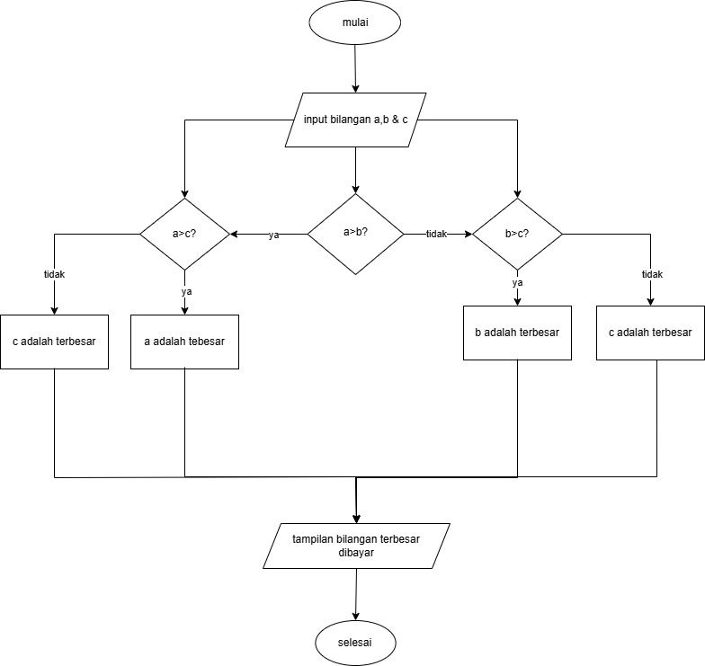

# Program mencari bilangan terbesar dari 3 bilangan yang diinputkan
program sederhana untuk mencari nilai terbesar dari 3 bilangan yang diinputkan
## Rincian Program
program ini ditulis menggunakan bahasa python dan memiliki fungsi sebagai berikut:

Menggunakan 'int' untuk mendefinisikan input. memanfaatkan fungsi 'if' untuk membuat skenario pengeliminasi fungsi pada input.
Memanfaatkan fungsi 'else' jika sekenario adalah sebaliknya.

## flowchart


## code
````
a = int(input("Masukkan bilangan A: "))
b = int(input("Masukkan bilangan B: "))
c = int(input("Masukkan bilangan C: "))

if a > b:
    if a > c:
        print("Bilangan A adalah terbesar")
    else:
        print("Bilangan C adalah terbesar")
else:
    if b > c:
        print("Bilangan B adalah terbesar")
    else:
        print("Bilangan C adalah terbesar")
````
## output
````
Masukkan bilangan A: 
30
Masukkan bilangan B: 
120
Masukkan bilangan C: 
60
Bilangan B adalah terbesar
````
## penjelasan code
Program ini menjelaskan bilangan terbesar dari 3 bilangan yang di inputkan oleh pengguna dengan cara:
Masukan A,B,C setelah masukan bilangan kemudian, cek bilangan mana yang mempunyai nilai terbesar
A > B? if yes (bilangan terbesar adalah A) kemudian A > C if yes bilangan terbesar adalah A if no (bilangan terbesar adalah C)
B > SEBUAH? if yes (bilangan terbesar adalah B) kemudian B > C if yes bilangan terbesar adalah B if no (bilangan terbesar adalah C).

# Program Mencari Bilangan Terbesar Menggunakan Looping Sederhana
Program sederhana untuk mencari nilai terbesar dari kumpulan bilangan yang diinputkan menggunakan perulangan sederhana menggunakan pernyataan while dan break.

## Rincian Program

Program ini ditulis dalam bahasa Python dan memiliki fitur sebagai berikut:

- Menggunakan loop while True untuk perulangan yang tidak terbatas.

- Memanfaatkan pernyataan break untuk mengakhiri program eksekusi.

- Bandingkan setiap masukan dengan nilai maksimum yang sudah ada.

- Menampilkan angka tertinggi yang berhasil ditemukan

## Flowchart

## code
````
bilangan = int(input("masukan bilangan: "))
max = 0

while bilangan != 0:
    if bilangan > 0:
        max = bilangan
    bilangan = int(input("masukan bilangan 0 untuk berhenti: "))
    
print(f"adalah bilangan terbesar{max}")
````
## output
````
masukan bilangan: 
10
masukan bilangan 0 untuk berhenti: 
20
masukan bilangan 0 untuk berhenti: 
30
masukan bilangan 0 untuk berhenti: 
40
masukan bilangan 0 untuk berhenti: 
50
masukan bilangan 0 untuk berhenti: 
0
adalah bilangan terbesar50
````
## Penjelasan Kode

Inisialisasi Program Cara Kerja: Program dimulai dengan nilai_terbesar diset ke None.

- Loop: Program berjalan dalam loop tanpa batas.

- Input:Program meminta pengguna memasukkan angka. Jika pengguna memasukkan 0, program berhenti.

- Pembaruan: Jika angka lebih besar dari nilai_terbesar, program memperbarui nilai_terbesar. Output: Setelah keluar dari loop, program -

- menampilkan angka terbesar yang ditemukan, atau pesan jika tidak ada angka yang dimasukkan.
